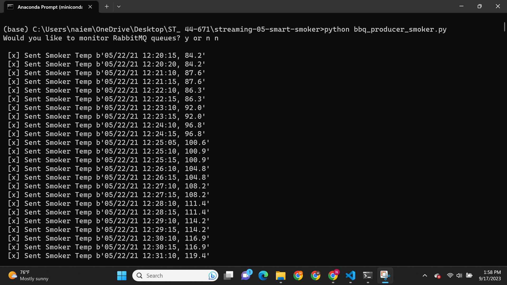
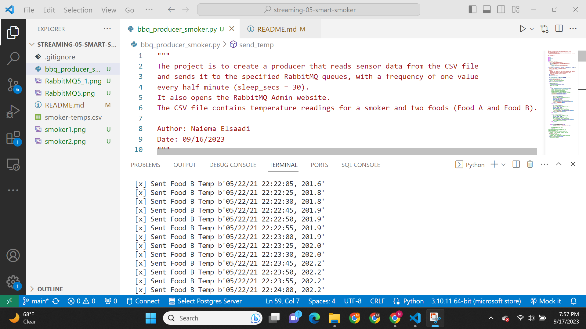
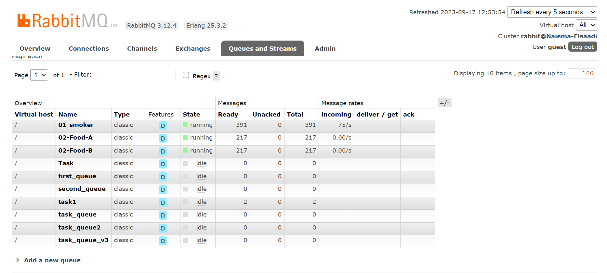
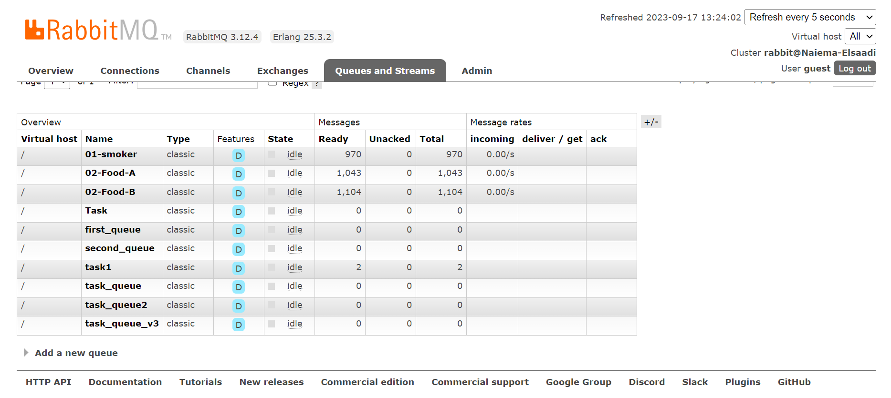

# streaming-05-smart-smoker
This project implements a data producer for streaming sensor data from a smart smoker system. The sensor data is stored in a CSV file, and the producer reads this data and sends it to RabbitMQ queues. The data includes temperature readings for the smoker itself and two food items (Food A and Food B), with readings taken every 30 seconds.

 Author: Naiema Elsaadi 
 Date: September 16, 2023 

## Getting Started

  <B> Before You Begin </b> 
 
Before running the producer, ensure the following requirements are met:

- RabbitMQ server is running.
- The `pika` library is installed in your active Python environment.

## The key features of this project include:

- Reading sensor data from the CSV file.
- Sending data to RabbitMQ queues with specified queue names.
- Simulating sensor data streaming at a rate of one value every 30 seconds.
- Opening the RabbitMQ Admin website for queue monitoring.

## How to Use

**To use the producer, follow these steps:**

1. Clone this repository to your local machine.
2. Make sure RabbitMQ is running.
3. Install the `pika` library if not already installed (`pip install pika`).
4. Execute the `bbq_producer_smoker.py` script.
5. You will be prompted to open the RabbitMQ Admin website for queue monitoring (optional).
6. The producer will start sending sensor data to the specified queues with a frequency of one value every half minute.

## Usage

1. Run the  python file in the bash:
in anaconda Prompt (miniconda3) run this: 
  1. **python bbq_producer_smoker.py**

  
  

   ## Reference

- [RabbitMQ Tutorial - Work Queues](https://www.rabbitmq.com/tutorials/tutorial-two-python.html)

## The following modules are used in this project:
  csv	
  webbrowser
  signal	
  sys	
  time	
  pika
<b>  socket

## Prerequisites
 Git
 Python 3.10+ 
 VS studio Code 
 anaconda prompt (miniconda3)
 RabbitMQ

## Multiple Terminals Screenshots

## RabbitMQ WebInterface screenshot:

